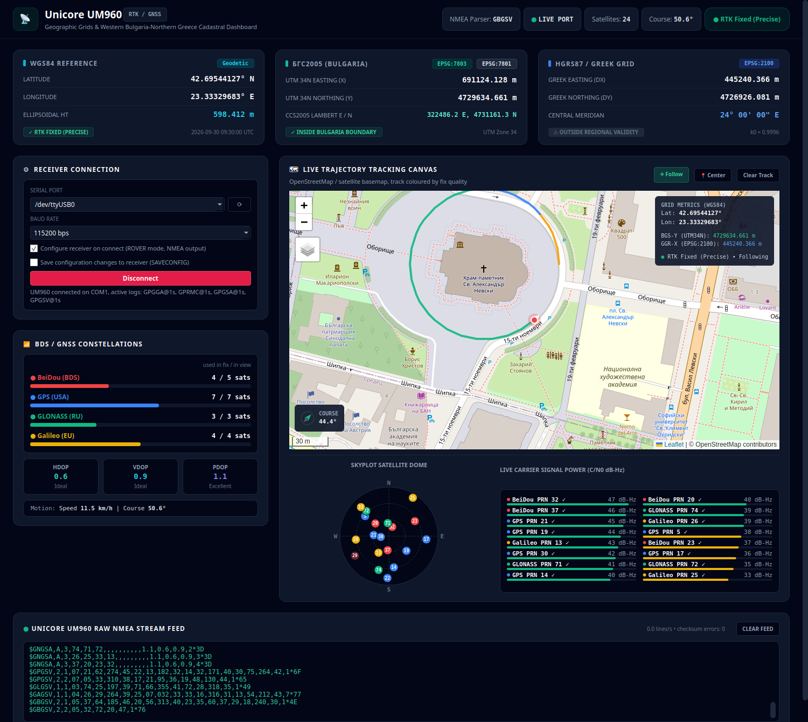

# Unicore UM960 GNSS Dashboard

Real-time tracking and GIS dashboard for the **Unicore UM960** GNSS RTK receiver.
It decodes the receiver's NMEA stream and converts each position from WGS84 into the
Bulgarian **BGS2005** grids (UTM 34N and CCS2005 Lambert) and the Greek **GGRS87 / Greek Grid**.

The repository contains three front ends that share the same decoding and coordinate logic:

| Tool | File | Connection | Best for |
|---|---|---|---|
| **Desktop dashboard** (PySide6) | `um960_dashboard_qt.py` | pyserial, reconnects automatically | Field use with a real receiver |
| **Matplotlib tracker** | `unicore_um960_tracker.py` | pyserial, or `--simulate` | Minimal plotting, headless-friendly demo |
| **Web app** (React + Vite) | `src/` | Web Serial API (Chrome / Edge) | Quick look in the browser, simulated routes |

## Features

- Live WGS84 position, ellipsoidal height, fix quality (Single / DGPS / RTK Float / RTK Fixed), speed and course
- Conversion to BGS2005 / UTM 34N (EPSG:7803), BGS2005 / CCS2005 Lambert (EPSG:7801) and GGRS87 / Greek Grid (EPSG:2100)
- Satellites per constellation (GPS, GLONASS, Galileo, BeiDou), used in fix vs in view, HDOP / VDOP / PDOP
- Skyplot and per-satellite carrier-to-noise (C/N0) bars
- Trajectory on an OpenStreetMap or satellite basemap, coloured by fix quality
- Raw NMEA feed with checksum validation
- Automatic receiver setup on connect: switches the UM960 to ROVER mode if needed and enables the NMEA messages the dashboard uses
- Built-in NTRIP client (desktop dashboard): RTK corrections from a caster are sent to the receiver over the same serial port

## Hardware

- Unicore UM960 module (or a breakout board with one) and a GNSS antenna with a clear view of the sky
- A USB-UART adapter (e.g. FTDI FT232R) connected to one of the module's COM ports, 115200 baud by default

On power-up the module prints a single line naming the port you are connected to (e.g. `$devicename,COM1*67`).
A factory-configured module outputs nothing else until messages are enabled, which the desktop dashboard and the tracker do for you.
RTK corrections (RTCM) are detected automatically on any COM port. The desktop dashboard sends them through the same
port it reads NMEA from, so a single USB-UART adapter is enough.

On Linux, add your user to the `dialout` group to access serial ports without root:

```bash
sudo usermod -aG dialout $USER   # then log out and back in
```

## Desktop dashboard (PySide6)


*Desktop dashboard with a sample track around Alexander Nevsky Cathedral, Sofia.*

A Qt port of the web app's GIS dashboard. The map is Leaflet running in a `QWebEngineView`: it is loaded once and
updated through JavaScript, so it does not reload or flicker on every fix.

### Install

```bash
pip install PySide6 pyserial pyproj
```

### Run

```bash
python3 um960_dashboard_qt.py
```

Choose the serial port and baud rate, then click **Connect**. Stable `/dev/serial/by-id/...` names are listed first,
since they survive the adapter being re-plugged. The last port used is remembered.

| Option | Description |
|---|---|
| `--port PORT` | Serial port, e.g. `/dev/ttyUSB0` or a `/dev/serial/by-id/` path |
| `--baud BAUD` | Baud rate (default: last used, or 115200) |
| `--connect` | Connect immediately on start |
| `--no-configure` | Do not check or change the receiver configuration |
| `--save-config` | Save configuration changes to the receiver's flash (`SAVECONFIG`) |
| `--ntrip` | Start NTRIP corrections on start, using the saved caster settings |

Notes:

- On connect the dashboard checks the receiver mode and enables `GPGGA`, `GPRMC`, `GPGSA` and `GPGSV` at 1 Hz.
  Changes are lost at power-off unless **Save configuration changes** (or `--save-config`) is enabled.
- If the serial port drops out (e.g. a flaky USB adapter), it is reopened every 2 seconds.
- The basemap needs an internet connection. Map tiles are cached on disk between runs.
  All other panels work offline.

### RTK corrections (NTRIP)

The **NTRIP Corrections** panel connects to an NTRIP caster and forwards the RTCM stream to the receiver.
Enter the caster, port (usually 2101), mountpoint, user name and password, then click **Start Corrections**.

- The receiver's position (GGA) is sent to the caster every 10 seconds. Network / VRS mountpoints need it,
  single-station mountpoints ignore it.
- The panel shows the data received, the time since the last correction, the RTCM message types, and whether the
  receiver is actually using the corrections (age of differential from GGA). The fix badge changes to
  **RTK Float** and then **RTK Fixed** once the solution converges.
- The **NTRIP log** in the panel keeps the last 50 events with timestamps: connection attempts, refusals with the
  caster's own explanation (e.g. `401 Unauthorized: Invalid user name or password`), dropped connections, and when
  the receiver starts using the corrections or its fix changes to RTK Float / Fixed.
- An unknown mountpoint, wrong credentials or a refused account stop the client. Network errors and temporary
  refusals (e.g. `503`) are retried every 5 seconds.
- Mountpoint names must match the caster's source table exactly. For example, Sofia on
  [igs-ip.net](http://www.igs-ip.net/home) is `SOFI00BGR0`. Free registration for the IGS and EUREF casters is at
  [register.rtcm-ntrip.org](https://register.rtcm-ntrip.org/).
- The password is not saved in the settings file. Install `keyring` (`pip install keyring`) and tick
  **Remember password** to keep it in the system keyring, or set the `UM960_NTRIP_PASSWORD` environment variable.

RTK needs a reference station reasonably close to the receiver: a baseline of up to about 20–30 km for a
reliable fixed solution.

## Matplotlib tracker

A lightweight script that plots the trajectory in BGS2005 UTM 34N and the Greek Grid side by side.

```bash
pip install pyserial pyproj matplotlib

python3 unicore_um960_tracker.py --port /dev/ttyUSB0 --baud 115200
python3 unicore_um960_tracker.py --simulate     # demo route Sofia -> Thessaloniki, no hardware needed
```

| Option | Description |
|---|---|
| `--rover-mode {SURVEY,UAV,AUTOMOTIVE,DEFAULT}` | ROVER sub-mode applied if the receiver is not already a rover (default `SURVEY`) |
| `--skip-mode-check` | Do not query or change the receiver mode |
| `--nmea-messages LIST` | Comma-separated NMEA messages to enable (default `GPGGA,GPRMC`, `''` to skip) |
| `--nmea-interval SECONDS` | NMEA output interval (default 1, `0.2` for 5 Hz) |
| `--save-config` | Save configuration changes to the receiver's flash |

## Web app

**Prerequisites:** Node.js, and Chrome or Edge (Web Serial is not available in Firefox or Safari).

```bash
npm install
npm run dev        # http://localhost:3000
```

Click **Connect COM** and pick the receiver's port. Without a receiver, the app plays one of the built-in simulated routes.
Web Serial only works on `localhost` or over HTTPS. For long sessions in the field, the desktop dashboard is more robust.

The **Python Script Exporter** tab downloads a standalone copy of the matplotlib tracker with your port and baud rate filled in.

## Coordinate reference systems

| Grid | EPSG | Projection | False easting / northing |
|---|---|---|---|
| WGS84 | 4326 | Geographic | – |
| BGS2005 / UTM zone 34N | 7803 | Transverse Mercator, CM 21°E, k0 = 0.9996 | 500 000 m / 0 m |
| BGS2005 / CCS2005 | 7801 | Lambert Conformal Conic, parallels 42°N and 43°20'N, origin 42°40'04.35"N 25°30'E | 500 000 m / 4 725 824.3591 m |
| GGRS87 / Greek Grid | 2100 | Transverse Mercator, CM 24°E, k0 = 0.9996 | 500 000 m / 0 m |

The Python tools use the EPSG definitions from the PROJ database via `pyproj`. The web app uses equivalent
PROJ strings with `proj4`. Both give identical results.

## Receiver commands

Configuration uses the Unicore ASCII command set, as documented for the
[SparkFun Unicore GNSS Arduino library](https://docs.sparkfun.com/SparkFun_UM980_Triband_GNSS_RTK_Breakout/arduino_examples/):

| Command | Purpose | Reply |
|---|---|---|
| `MODE` | Query the current mode | `#MODE,...;MODE ROVER SURVEY,*67` |
| `MODE ROVER SURVEY` | Switch to rover mode | `$command,MODE ROVER SURVEY,response: OK*..` |
| `LOGLIST` | List enabled output messages | `<LOGLIST COM1 ...` followed by one line per message |
| `GPGGA 1` | Output GGA every second on the current port | `$command,GPGGA 1,response: OK*19` |
| `SAVECONFIG` | Persist the configuration | `$command,SAVECONFIG,response: OK*..` |

## Project structure

```
um960_dashboard_qt.py      PySide6 desktop dashboard
unicore_um960_tracker.py   Matplotlib tracker (also the source of the web app's script export)
um960_core.py              Shared code: coordinate conversions, receiver configuration
gen_python_script_text.py  Regenerates src/pythonScriptText.ts from the two Python files above
src/                       Web app (React, Vite, Tailwind, proj4)
```

After changing `unicore_um960_tracker.py` or `um960_core.py`, regenerate the web app's script export:

```bash
python3 gen_python_script_text.py
```

## License

Released under the [Apache License 2.0](LICENSE).
